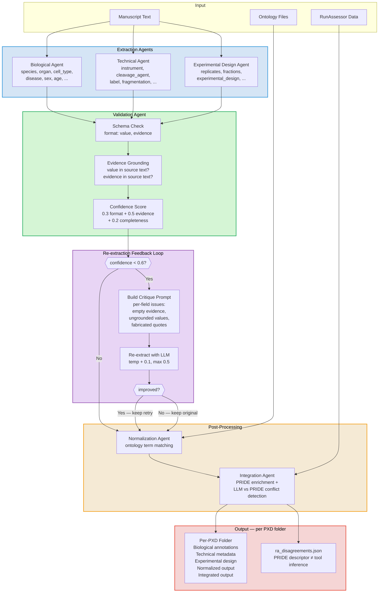

# Extraction Framework — Pipeline Architecture

```mermaid
flowchart TD
    subgraph Input
        MS["Manuscript Text"]
        RA["RunAssessor Data"]
        ONT["Ontology Files"]
    end

    subgraph Extraction["Extraction Agents"]
        BIO["Biological Agent<br/>species, organ, cell_type,<br/>disease, sex, age, ..."]
        TECH["Technical Agent<br/>instrument, cleavage_agent,<br/>label, fragmentation, ..."]
        EXP["Experimental Design Agent<br/>replicates, fractions,<br/>experimental_design, ..."]
    end

    subgraph Validation["Validation Agent"]
        SCHEMA["Schema Check<br/>format: value, evidence"]
        EVIDENCE["Evidence Grounding<br/>value in source text?<br/>evidence in source text?"]
        CONF["Confidence Score<br/>0.3 format + 0.5 evidence<br/>+ 0.2 completeness"]
    end

    subgraph Feedback["Re-extraction Feedback Loop"]
        DECIDE{{"confidence < 0.6?"}}
        CRITIQUE["Build Critique Prompt<br/>per-field issues:<br/>empty evidence,<br/>ungrounded values,<br/>fabricated quotes"]
        REEXTRACT["Re-extract with LLM<br/>temp + 0.1, max 0.5"]
        COMPARE{{"improved?"}}
    end

    subgraph PostProcessing["Post-Processing"]
        NORM["Normalization Agent<br/>ontology term matching"]
        INTEG["Integration Agent<br/>PRIDE enrichment +<br/>LLM vs PRIDE conflict detection"]
    end

    subgraph Output["Output — per PXD folder"]
        PXDDIR["Per-PXD Folder<br/>Biological annotations<br/>Technical metadata<br/>Experimental design<br/>Normalized output<br/>Integrated output"]
        DISAGREE["ra_disagreements.json<br/>PRIDE descriptor ≠ tool inference"]
    end

    MS --> BIO
    MS --> TECH
    MS --> EXP
    BIO --> SCHEMA
    TECH --> SCHEMA
    EXP --> SCHEMA
    SCHEMA --> EVIDENCE
    EVIDENCE --> CONF

    CONF --> DECIDE
    DECIDE -->|"No"| NORM
    DECIDE -->|"Yes"| CRITIQUE
    CRITIQUE --> REEXTRACT
    REEXTRACT --> COMPARE
    COMPARE -->|"Yes — keep retry"| NORM
    COMPARE -->|"No — keep original"| NORM

    ONT --> NORM
    NORM --> INTEG
    RA --> INTEG
    INTEG --> PXDDIR
    INTEG --> DISAGREE

    style Feedback fill:#e8d5f5,stroke:#9b59b6,stroke-width:2px,color:#000
    style Validation fill:#d5f5d5,stroke:#27ae60,stroke-width:2px,color:#000
    style Extraction fill:#d5e5f5,stroke:#3498db,stroke-width:2px,color:#000
    style PostProcessing fill:#f5ead5,stroke:#f39c12,stroke-width:2px,color:#000
    style Output fill:#f5d5d5,stroke:#e74c3c,stroke-width:2px,color:#000
```
